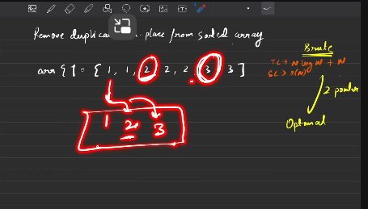

 When you use a TreeSet, the insertion operation takes O(log k) time, where k is the current size of the set.

Here’s why:

Why O(log n) for insertion?
A TreeSet is backed by a self-balancing binary search tree (like a Red-Black Tree).

Every time you insert an element, it has to search for the correct position in the tree (which takes O(log k) time, where k is the size of the tree at that point).

```java
class Solution {
    // Function to remove duplicates from the array
    public int removeDuplicates(int[] nums) {

        // TreeSet to store unique elements in sorted order
        Set<Integer> s = new TreeSet<>();

        // Add all elements from array to the set
        for (int val : nums) {
            s.add(val);
        }

        // Get the number of unique elements
        int k = s.size();

        int j = 0;
        // Copy unique elements from set to array
        for (int val : s) {
            nums[j++] = val;
        }

        // Return the number of unique elements
        return k;
    }
}
```


## Optimal


```java
class Solution {
    public int removeDuplicates(int[] nums) {
        int n= nums.length;
        int j =0;
        for(int i =1;i<n;i++){
              if(nums[i] != nums[j]){
                    j++;
                    nums[j] = nums[i];
              }
        }
        return j+1;
    }
}
```
