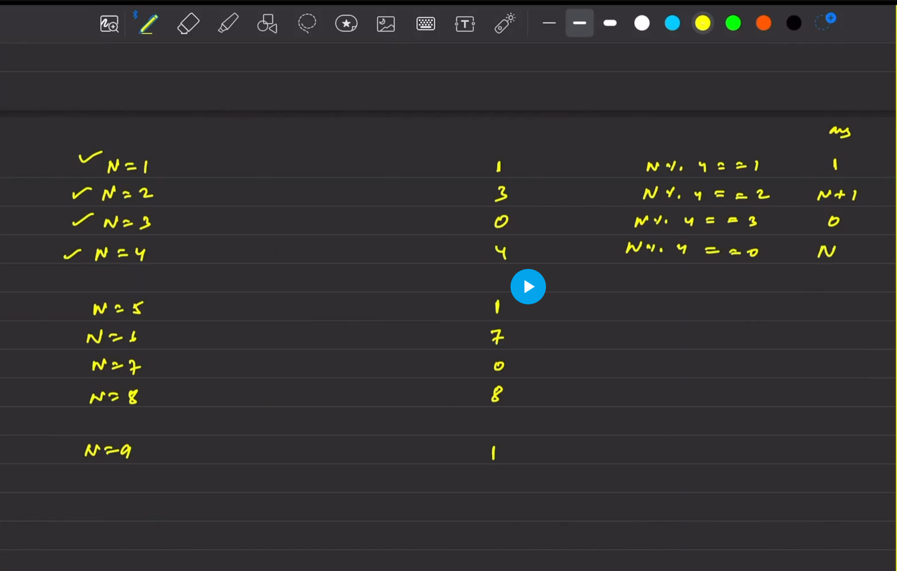
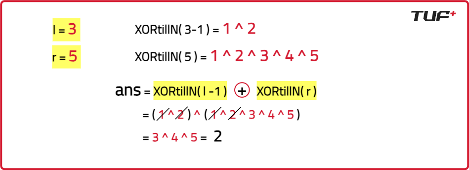

# XOR of Numbers in a Given Range

**Refer:**



## Intuition
XORing every number in the given range will be time-consuming and inefficient.

To solve this problem efficiently, we use the following observation:
The XOR of numbers from `1` to `n` follows a pattern based on the value of `n % 4`:

- If `n % 4 == 0`, XOR from `1` to `n` is `n`.
- If `n % 4 == 1`, XOR from `1` to `n` is `1`.
- If `n % 4 == 2`, XOR from `1` to `n` is `n + 1`.
- If `n % 4 == 3`, XOR from `1` to `n` is `0`.

For the required answer, the following formula can be used:
```plaintext
XOR(L to R) = XOR(1 to L-1) ^ XOR(1 to R)
```

## Code Implementation

```java
import java.util.*;

class Solution {
    /* Function to find the XOR
    of numbers from 1 to n */
    private int XORtillN(int n) {
        if(n % 4 == 1) return 1;
        if(n % 4 == 2) return n + 1;
        if(n % 4 == 3) return 0;
        return n;
    }

    /* Function to find the XOR
    of numbers from L to R */
    public int findRangeXOR(int l, int r) {
        return XORtillN(l - 1) ^ XORtillN(r);
    }

    public static void main(String[] args) {
        int l = 3, r = 5;

        /* Creating an instance of
        Solution class */
        Solution sol = new Solution();

        /* Function call to get the
        XOR of numbers from L to R */
        int ans = sol.findRangeXOR(l, r);

        System.out.println("The XOR of numbers from " + l + " to " + r + " is: " + ans);
    }
}
```

## Complexity Analysis
- **Time Complexity**: `O(1)`, since we use a mathematical formula to compute XOR in constant time.
- **Space Complexity**: `O(1)`, since no extra space is used.

## Example
```java
public class Main {
    public static void main(String[] args) {
        Solution sol = new Solution();
        int l = 4, r = 8;
        int ans = sol.findRangeXOR(l, r);
        System.out.println("The XOR of numbers from " + l + " to " + r + " is: " + ans);
    }
}
```

**Output:**
```
The XOR of numbers from 4 to 8 is: 8
```
