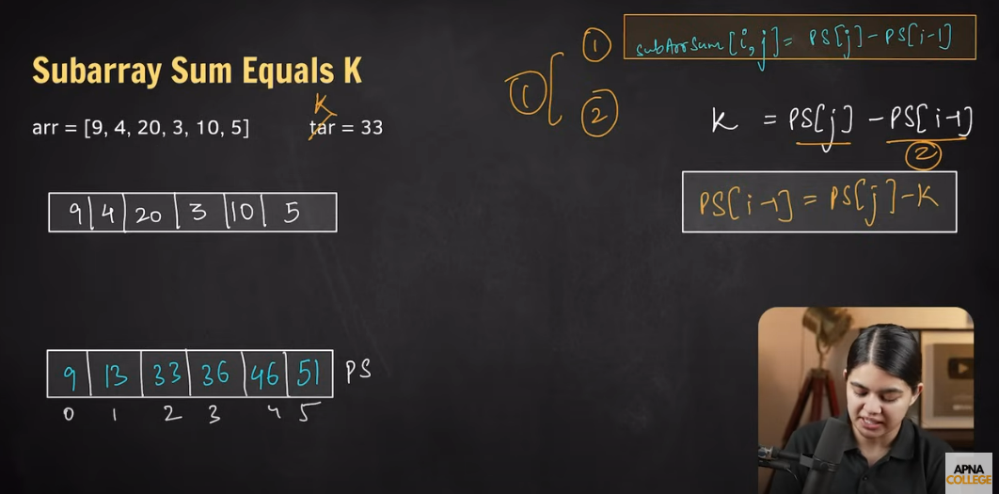

**Subarray Sum Equals K - Notes**

### **Problem Statement:**

Given an array of integers `nums` and an integer `k`, return the total number of subarrays whose sum equals `k`.
A subarray is a contiguous non-empty sequence of elements within an array.

### **Example:**

#### **Input:**

```plaintext
nums = [1,1,1], k = 2
```

#### **Output:**

```plaintext
2
```

#### **Explanation:**

The two subarrays that sum to `2` are: `[1,1]` (starting at index 0) and `[1,1]` (starting at index 1).

### **Approach Order to Solve:**

1. **Brute Force (O(N^2))**
2. **Better Approach (Prefix Sum + HashMap, O(N))**
3. **Sliding Window / Two Pointer (Works only for non-negative numbers)**
---

## **1. Brute Force Approach**

- Generate all subarrays.
- Compute their sum.
- Count those that match `k`.

```java
class Solution {
    public int subarraySum(int[] nums, int k) {
        int n = nums.length;
        int count = 0;
        for (int i = 0; i < n; i++) {
            int sum = 0;
            for (int j = i; j < n; j++) {
                sum += nums[j];
                if (sum == k) {
                    count++;
                }
            }
        }
        return count;
    }
}
```

- **Time Complexity:** `O(N^2)` (Nested loops for generating subarrays)
- **Space Complexity:** `O(1)`

---

## **2. Optimal Approach (Prefix Sum + HashMap)**

- Use a **prefix sum** and store frequencies in a HashMap.
- Check for previous prefix sums that satisfy `prefix[j] - prefix[i] = k`.

```java
import java.util.HashMap;

class Solution {
    public int subarraySum(int[] nums, int k) {
        int n = nums.length;
        int prefixSum = 0;
        HashMap<Integer, Integer> mpp = new HashMap<>();
        int count = 0;

        for (int j = 0; j < n; j++) {
            prefixSum += nums[j]; // Update prefix sum

            // Case 1: If prefixSum itself is k, count this as a valid subarray
            if (prefixSum == k) count++;

            // Case 2: If `prefixSum - k` exists in the map, add its frequency to count
            int leftout = prefixSum - k;
            if (mpp.containsKey(leftout)) {
                count += mpp.get(leftout);
            }

            // Case 3: Store `prefixSum` in the map for future subarrays
            mpp.put(prefixSum, mpp.getOrDefault(prefixSum, 0) + 1);
        }

        return count;
    }
}

```

- **Time Complexity:** `O(N)` (Single pass through the array)
- **Space Complexity:** `O(N)` (HashMap storage for prefix sums)

---

## **3. Two Pointer / Sliding Window Approach**

⚠ **This only works for non-negative numbers** (because shrinking the window might remove valid subarrays otherwise)
Key Issue with Sliding Window Approach
The Sliding Window approach only works for positive numbers because it assumes that expanding increases the sum and shrinking decreases it predictably.

For mixed numbers (including zeros or negatives), it fails because shrinking does not always reduce the sum correctly.

💡 Solution:
👉 The correct approach for all cases (including negatives and zeros) is Prefix Sum + HashMap.

### **Correct Order of Operations:**
1. **Expand**: `right++` and `sum += nums[right]`
2. **Shrink**: `left++` only when `sum > k`
3. **Count**: If `sum == k`, increment `cnt`

```java
class Solution {
    public int subarraySum(int[] nums, int k) {
        int count = 0, left = 0, right = 0, sum = 0, n = nums.length;
        while (right < n) {
            sum += nums[right];
            while (sum > k && left <= right) { // Adjust left pointer
                sum -= nums[left];
                left++;
            }
            if (sum == k) count++;
            right++;
        }
        return count;
    }
}
```

- **Time Complexity:** `O(N)` (Each element is processed once)
- **Space Complexity:** `O(1)` (No extra storage used)
- **Fails for negative numbers** because shrinking the window might discard valid subarrays.

---

### **Common Mistakes to Avoid:**

❌ Using Sliding Window for arrays with **negative numbers** – it doesn't work because sum may decrease unexpectedly.

❌ Not initializing the HashMap with `0 -> 1` in the **prefix sum** approach.

❌ Forgetting to update HashMap correctly when storing `prefixSum`.

---

### **Conclusion:**

- Use **Brute Force** for understanding the problem.
- Use **Prefix Sum + HashMap** for an optimal `O(N)` solution.
- **Sliding Window** is useful but only works for non-negative numbers.
- Avoid common pitfalls when implementing these solutions!
