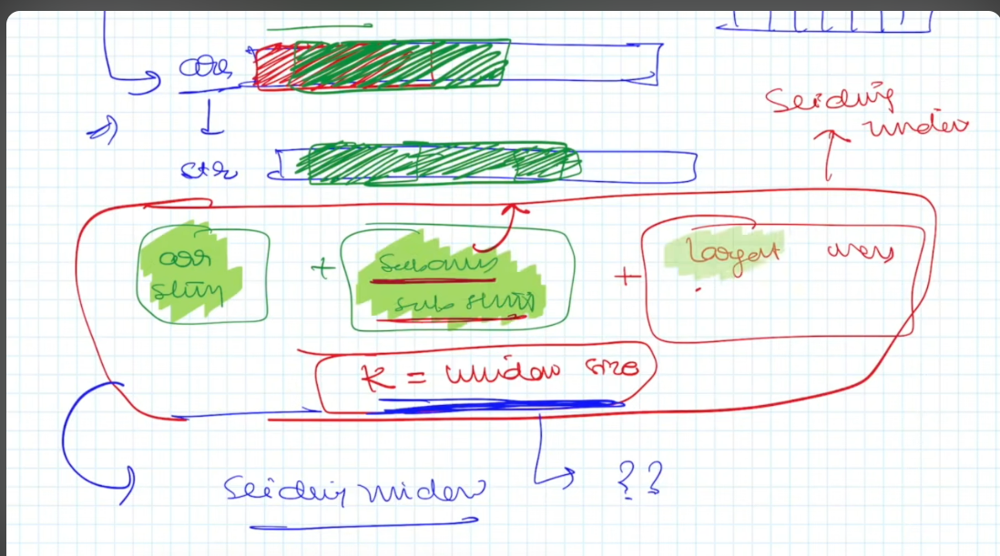
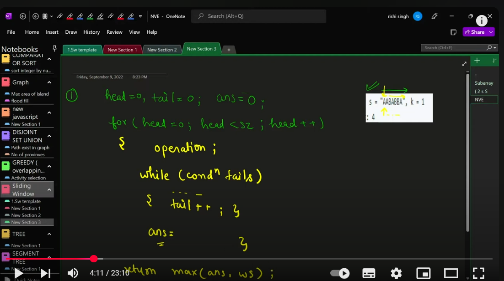

# Sliding Window Concept





## Identifying the Pattern
Sliding Window is a technique used to optimize problems involving **contiguous subarrays or substrings** by maintaining a dynamic window and moving it efficiently instead of recalculating from scratch.

### Common Indicators:
1. The problem involves **subarrays or substrings**.
2. It requires finding **maximum/minimum/sum/count** within a contiguous range.
3. There is a constraint that suggests a **fixed or variable window size**.
4. The problem can be solved using **nested loops**, but that approach is inefficient.

## General Approach to Solve Sliding Window Problems
1. **Initialize Pointers:** Define `left` and `right` pointers at the start.
2. **Expand the Window:** Move the `right` pointer to include new elements.
3. **Update State:** Maintain the required condition (sum, count, unique elements, etc.).
4. **Shrink the Window (if needed):** If the condition is violated, move the `left` pointer.
5. **Store/Update the Result:** Keep track of the optimal result.
6. **Repeat Until the Right Pointer Reaches the End.**

## Template for Variable Sliding Window
```java
public int slidingWindow(int[] arr) {
    int left = 0, maxResult = 0;
    HashMap<Integer, Integer> map = new HashMap<>();

    for (int right = 0; right < arr.length; right++) {
        // Expand window
        map.put(arr[right], map.getOrDefault(arr[right], 0) + 1);

        // Shrink window if necessary
        while (map.size() > someCondition) {
            map.put(arr[left], map.get(arr[left]) - 1);
            if (map.get(arr[left]) == 0) map.remove(arr[left]);
            left++;
        }

        // Update result
        maxResult = Math.max(maxResult, right - left + 1);
    }
    return maxResult;
}
```

## Example Problem: Maximum Fruits Collected in Two Baskets
### Problem Understanding:
- We have an array representing fruit types on trees.
- We can only carry **two types** of fruits at a time.
- We must collect as many fruits as possible in a contiguous manner.

### Solution Using Sliding Window
```java
public int totalFruits(int[] fruits) {
    int left = 0, maxFruits = 0;
    HashMap<Integer, Integer> basket = new HashMap<>();

    for (int right = 0; right < fruits.length; right++) {
        // Add fruit to the basket
        basket.put(fruits[right], basket.getOrDefault(fruits[right], 0) + 1);

        // If more than 2 types of fruits, shrink the window
        while (basket.size() > 2) {
            basket.put(fruits[left], basket.get(fruits[left]) - 1);
            if (basket.get(fruits[left]) == 0) basket.remove(fruits[left]);
            left++;
        }

        // Update max result
        maxFruits = Math.max(maxFruits, right - left + 1);
    }
    return maxFruits;
}
```

## Key Takeaways:
- Expand the window by adding elements.
- Shrink when constraints are violated.
- Keep track of the best result.
- Efficient for problems with **contiguous subarrays**.

This method can be used for problems like **longest substring with at most k distinct characters, longest ones with at most k zero flips, max sum subarray of size k, etc.** 🚀
