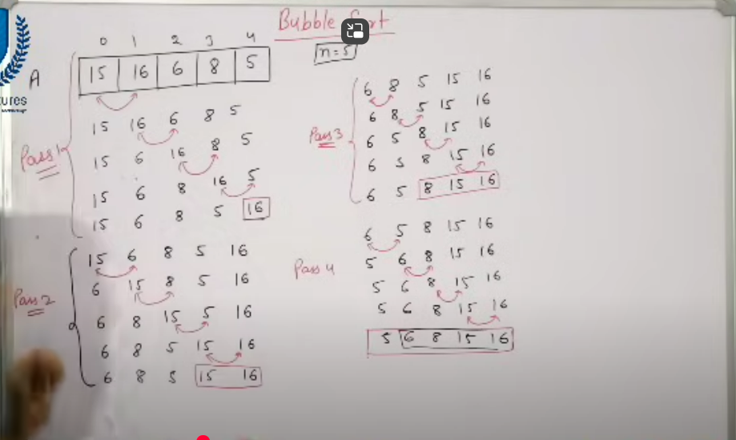

# 📌 Bubble Sort – Intuition & Code

## 🧠 Intuition / Idea
Bubble Sort is a **simple comparison-based sorting algorithm**.

- It repeatedly **steps through the list**, compares **adjacent elements**, and **swaps** them if they are in the **wrong order**.
- This process is repeated until the list is **sorted**.
- On each pass, the **largest unsorted element “bubbles up”** to its correct position at the end.

## 🔁 How it works:
- Run outer loop `n-1` times.
- For each pass, compare adjacent elements.
- Swap them if they’re out of order.
- After each pass, the largest unsorted element goes to its correct position.

## ✅ Optimization Tip:
If no swaps happen in a full pass, array is already sorted. Use a `swapped` flag.

## 📦 Time & Space Complexity
| Case       | Time   | Explanation                          |
|------------|--------|--------------------------------------|
| Best Case  | O(n)   | Already sorted, with optimization    |
| Average    | O(n²)  | General case                         |
| Worst Case | O(n²)  | Reversed array                       |
- Space: O(1) – In-place sorting



```java
public class BubbleSort {
    public static void bubbleSort(int[] arr) {
        int n = arr.length;
        boolean swapped;

        // number of passes n-1
        for (int i = 0; i < n - 1; i++) {
            swapped = false;
            // swap
            for (int j = 0; j < n - i - 1; j++) {
                if (arr[j] > arr[j + 1]) {
                    // Swap if in wrong order
                    int temp = arr[j];
                    arr[j] = arr[j + 1];
                    arr[j + 1] = temp;
                    swapped = true;
                }
            }

            // Optimization: Stop if no swaps happened
            if (!swapped) break;
        }
    }

    public static void main(String[] args) {
        int[] arr = {5, 3, 8, 4, 2};
        bubbleSort(arr);

        for (int num : arr) {
            System.out.print(num + " ");
        }
    }
}
```

Normally, Bubble Sort blindly keeps looping n-1 times no matter what — even if the array is already sorted. That’s wasted effort.

To avoid this, we use a flag (usually named swapped) to track if any swaps were made during a full pass.


## ⚠️ Common Mistakes
- Not reducing the inner loop length by `i` → unnecessary comparisons.
- Forgetting to use a `swapped` flag → no optimization in best case.
- Using extra space for swapping (should be in-place).
