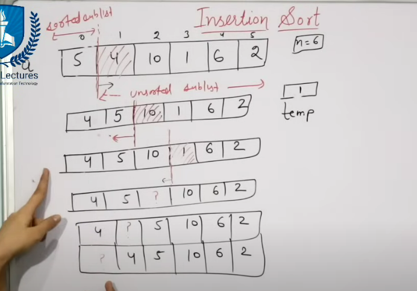
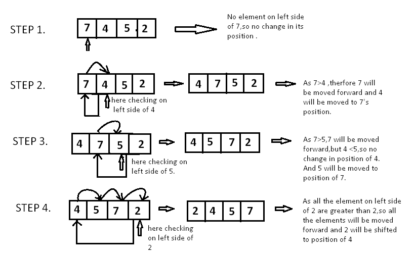

# 📌 Insertion Sort – Intuition & Code

## 🧠 Intuition / Idea
Insertion Sort is a **simple sorting algorithm** that works like how we sort playing cards in our hands.

- It builds the final sorted array **one element at a time**.
- It picks the next element (called `key`) and places it at the correct position in the already sorted part.
- For each element, it **shifts all larger elements to the right** to make space for the key.

## ⟳ How it works:
- Start from the second element (index 1).
- Compare it with the previous elements and **shift larger elements to the right**.
- Insert the `key` at the right position.




## 📦 Time & Space Complexity
| Case       | Time   | Explanation            |
|------------|--------|------------------------|
| Best Case  | O(n)   | Already sorted         |
| Average    | O(n²)  | Random order           |
| Worst Case | O(n²)  | Reversed array         |

- **Space**: O(1) – In-place sorting

---

```java
public class Solution {
  public int[] insertionSort(int[] arr) {
    int n = arr.length;
    for (int i = 1; i < n; i++) {
      int key = arr[i];
      int j = i - 1;

      // Shift elements of arr[0..i-1] that are greater than key
      while (j >= 0 && arr[j] > key) {
        arr[j + 1] = arr[j];
        j--;
      }
      arr[j + 1] = key;
    }
    return arr;
  }
}
```

---

## ⚠️ Common Mistakes
- ❌ Not starting from index 1
- ❌ Forgetting to assign `key` back at the correct position after shifting
- ❌ Going out of bounds (not checking `j >= 0`)
