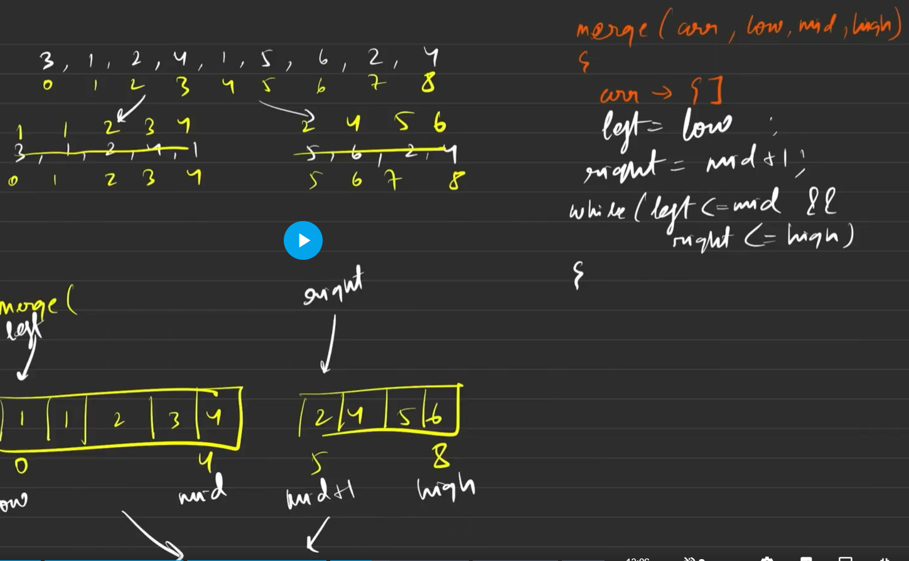

## 🧠 Merge Sort – Intuition & Code

### 🧠 Intuition / Idea
Merge Sort is a classic Divide and Conquer algorithm. We:

- Divide the array into two halves,

- Recursively sort each half,

- Then merge them into a single sorted array.

It ensures stable sorting and gives consistent performance across all types of inputs.

## 📈 Time & Space Complexity
| Case       | Time       | Explanation               |
| ---------- | ---------- | ------------------------- |
| Best Case  | O(n log n) | Every level processes `n` |
| Average    | O(n log n) | Always divides in half    |
| Worst Case | O(n log n) | Even on sorted/rev arrays |

Space: O(n) due to the temporary array used for merging.

## ✅ Yaad Rakho:
- Mid se partition karte hain (Divide & Conquer).

- Socho jaise 2 sorted arrays ban gaye: low to mid & mid+1 to high.

- Code mein alag array nahi banate — bas indexes ka use hota hai.

- In dono sorted parts ko merge karke ek sorted array banaate hain.

- Final output = dono parts ka sorted union.



## 🧩 Code
```java
class Solution {
    public void merge(int[] nums, int low, int high, int mid) {
        int n = nums.length;
        // Even though you're just sorting 2 elements, you're allocating space for all n elements again and again in every recursive call. That's a waste of space and slows things down for large inputs. - kyuki merge sirf last m thodi kaam ayege digram m dekhe aur bhi merging hoti h but hr baar same size aur itna bda arr thodi lenge dynamic lo jitna chahiye bs
        int[] mergearr = new int[high-low+1];
        int index = 0;
        int left = low;
        int right = mid + 1;

        while (left <= mid && right <= high) {
            if (nums[left] <= nums[right]) {
                mergearr[index++] = nums[left];
                left++;
            } else {
                mergearr[index++] = nums[right];
                right++;
            }
        }

        // Adding the remaining elements of left half
        while (left <= mid) {
            mergearr[index++] = nums[left];
            left++;
        }

        // Adding the remaining elements of right half
        while (right <= high) {
            mergearr[index++] = nums[right];
            right++;
        }

        // Transferring the sorted elements to original array
        for (int i = low; i <= high; i++) {
            nums[i] = mergearr[i - low];
        }
    }

    public void mergeSort(int[] nums, int low, int high) {
        if (low >= high) {
            return;
        }
        int mid = low + (high - low) / 2;
        mergeSort(nums, low, mid);
        mergeSort(nums, mid + 1, high);
        merge(nums, low, high, mid);
    }

    public int[] mergeSort(int[] nums) {
        int n = nums.length;
        int low = 0;
        int high = n - 1;
        mergeSort(nums, low, high);
        return nums;
    }
}
```
### ⚠️ Common Mistakes
❌ Forgetting to merge correctly — use a new array and then copy back

❌ Index mismatch when copying data back to the original array

❌ Using the wrong mid formula (can cause overflow)

❌ Assuming it works in-place (it doesn’t — uses extra space!)
