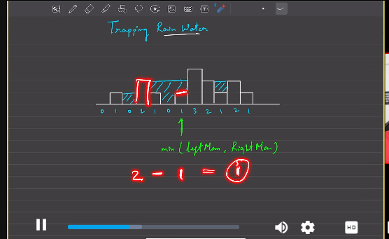

# Trapping Rainwater Problem

## Problem Statement
Given an array `height` of non-negative integers where each index represents the height of a bar, compute how much water can be trapped after raining.

## Example
### Input:
```java
height = [0,1,0,2,1,0,1,3,2,1,2,1];
```
### Output:
```java
6
```
### Explanation:
Water is trapped between the bars as shown below:
```
      |
  |---|--|
  |   |  |
```
Total trapped water = `6` units.

---

## Approach 1: Precomputed Arrays (Prefix & Suffix Max)
### Intuition:
- Precompute the maximum height to the left (`lmax`) and right (`rmax`) for each index.
- The water trapped at an index is `min(lmax, rmax) - height[i]`.

### Code:
```java
class Solution {
    public int[] findmaxPrefix(int[] arr, int n) {
        int[] maxPrefix = new int[n];
        maxPrefix[0] = arr[0];
        for(int i = 1; i < n; i++) {
            maxPrefix[i] = Math.max(maxPrefix[i-1], arr[i]);
        }
        return maxPrefix;
    }

    public int[] findmaxSuffix(int[] arr, int n) {
        int[] maxSuffix = new int[n];
        maxSuffix[n-1] = arr[n-1];
        for(int i = n-2; i >= 0; i--) {
            maxSuffix[i] = Math.max(maxSuffix[i+1], arr[i]);
        }
        return maxSuffix;
    }

    public int trap(int[] height) {
        int n = height.length;
        int[] prefix = findmaxPrefix(height, n);
        int[] suffix = findmaxSuffix(height, n);
        int total = 0;
        for(int i = 0; i < n; i++) {
            if(height[i] < prefix[i] && height[i] < suffix[i]) {
                total += Math.min(prefix[i], suffix[i]) - height[i];
            }
        }
        return total;
    }
}
```
### Complexity Analysis:
- **Time Complexity:** `O(N)`
- **Space Complexity:** `O(N)` (for storing prefix and suffix arrays)

---

## Approach 2: Two-Pointer Technique
### Intuition:
- Use two pointers (`l` and `r`) moving inward.
- Maintain `lmax` and `rmax` dynamically.
- If `lmax < rmax`, process the left pointer (`l++`), else process the right pointer (`r--`).

### Code:
```java
class Solution {
    public int trap(int[] height) {
        int l = 0, r = height.length - 1;
        int lmax = 0, rmax = 0, total = 0;

        while (l < r) {
            lmax = Math.max(lmax, height[l]);
            rmax = Math.max(rmax, height[r]);

            if (lmax < rmax) {
                total += lmax - height[l];
                l++;
            } else {
                total += rmax - height[r];
                r--;
            }
        }
        return total;
    }
}
```
### Complexity Analysis:
- **Time Complexity:** `O(N)`
- **Space Complexity:** `O(1)` (no extra space used)

---

## Approach 3: Optimized Two-Pointer Calculation
### Intuition:
- Instead of precomputing, dynamically update `maxLeft` and `maxRight`.
- Uses two pointers to track water trapped at each step.

### Code:
```java
class Solution {
    public int trap(int[] height) {
        if (height == null || height.length == 0) return 0;

        int left = 0, right = height.length - 1;
        int maxLeft = 0, maxRight = 0, water = 0;

        while (left <= right) {
            if (height[left] <= height[right]) {
                if (height[left] >= maxLeft) {
                    maxLeft = height[left];  // Update maxLeft
                } else {
                    water += maxLeft - height[left];  // Calculate trapped water
                }
                left++;  // Move left pointer
            } else {
                if (height[right] >= maxRight) {
                    maxRight = height[right];  // Update maxRight
                } else {
                    water += maxRight - height[right];  // Calculate trapped water
                }
                right--;  // Move right pointer
            }
        }
        return water;
    }
}
```
### Complexity Analysis:
- **Time Complexity:** `O(N)`
- **Space Complexity:** `O(1)`

---
## Summary
| Approach | Time Complexity | Space Complexity | Description |
|----------|----------------|------------------|-------------|
| Precomputed Arrays | `O(N)` | `O(N)` | Stores left & right max in arrays |
| Two-Pointer | `O(N)` | `O(1)` | Uses two pointers with `lmax` and `rmax` dynamically |
| Optimized Two-Pointer | `O(N)` | `O(1)` | Uses two pointers with `maxLeft` and `maxRight` dynamically |

This document provides all necessary details, explanations, and code implementations for understanding and solving the **Trapping Rainwater** problem effectively. 🚀
