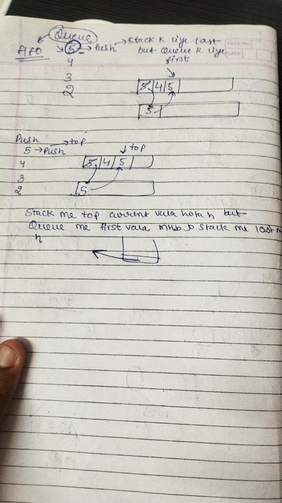

### **Queue Implementation Using Stacks**



#### **1. Concept Overview**

- A **Queue (FIFO - First In, First Out)** can be implemented using **two Stacks (LIFO - Last In, First Out)**.
- We use two stacks, `st1` (main stack) and `st2` (temporary stack), to simulate queue operations.
- Operations supported: `push()`, `pop()`, `peek()`, `isEmpty()`.

---

### **2. Implementation in Java**

```java
import java.util.*;

// Queue implementation using two Stacks
class StackQueue {
    private Stack<Integer> st1, st2;

    // Constructor
    public StackQueue() {
        st1 = new Stack<>();
        st2 = new Stack<>();
    }

    // Push operation (Enqueue)
    public void push(int x) {
        // Move all elements from st1 to st2
        while (!st1.isEmpty()) {
            st2.push(st1.pop());
        }

        // Insert the new element
        st1.push(x);

        // Move all elements back from st2 to st1
        while (!st2.isEmpty()) {
            st1.push(st2.pop());
        }
    }

    // Pop operation (Dequeue)
    public int pop() {
        if (st1.isEmpty()) {
            System.out.println("Queue is empty");
            return -1;
        }
        return st1.pop();
    }

    // Peek operation (Front of Queue)
    public int peek() {
        if (st1.isEmpty()) {
            System.out.println("Queue is empty");
            return -1;
        }
        return st1.peek();
    }

    // Check if the queue is empty
    public boolean isEmpty() {
        return st1.isEmpty();
    }
}

// Main class for execution
class Main {
    public static void main(String[] args) {
        StackQueue q = new StackQueue();

        // Array of commands
        String[] commands = {"StackQueue", "push", "push", "pop", "peek", "isEmpty"};
        int[][] inputs = {{}, {4}, {8}, {}, {}, {}};

        for (int i = 0; i < commands.length; i++) {
            if (commands[i].equals("push")) {
                q.push(inputs[i][0]);
                System.out.print("null ");
            } else if (commands[i].equals("pop")) {
                System.out.print(q.pop() + " ");
            } else if (commands[i].equals("peek")) {
                System.out.print(q.peek() + " ");
            } else if (commands[i].equals("isEmpty")) {
                System.out.print((q.isEmpty() ? "true" : "false") + " ");
            } else if (commands[i].equals("StackQueue")) {
                System.out.print("null ");
            }
        }
    }
}
```

---

### **3. Operations & Code Explanation**

#### **Push (Insert Element - Enqueue)**
📌 **Before pushing:**
- Move all elements from `st1` to `st2`.
- Insert the new element into `st1`.
- Move all elements back from `st2` to `st1`.

```java
public void push(int x) {
    while (!st1.isEmpty()) {
        st2.push(st1.pop());
    }
    st1.push(x);
    while (!st2.isEmpty()) {
        st1.push(st2.pop());
    }
}
```

#### **Pop (Remove and Return Front Element - Dequeue)**
📌 **Before popping:**
- Check if the queue is empty.
- Remove and return the top element from `st1`.

```java
public int pop() {
    if (st1.isEmpty()) {
        System.out.println("Queue is empty");
        return -1;
    }
    return st1.pop();
}
```

#### **Peek (Return Front Element Without Removing It)**
📌 **Before peeking:**
- Check if the queue is empty.
- Return the top element of `st1`.

```java
public int peek() {
    if (st1.isEmpty()) {
        System.out.println("Queue is empty");
        return -1;
    }
    return st1.peek();
}
```

#### **isEmpty (Check if Queue is Empty)**
✅ Returns `true` if there are no elements in `st1`.

```java
public boolean isEmpty() {
    return st1.isEmpty();
}
```

---

### **4. Summary**

| Operation   | Condition to Check | Key Action                        |
| ----------- | ------------------ | --------------------------------- |
| **Push**    | -                  | Move elements, insert, move back  |
| **Pop**     | Queue empty        | Remove and return front element   |
| **Peek**    | Queue empty        | Return front element              |
| **isEmpty** | -                  | Return `st1.isEmpty()`            |
