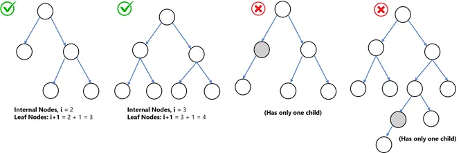

**Binary Tree Notes (Simplified)**

---

### 🌳 Introduction to Trees

Trees are **non-linear data structures** that organize data hierarchically, unlike arrays or linked lists. Binary Trees are a special type of tree where **each node has at most two children** — left and right.

Use Case: Great for representing hierarchical data like file systems, game states, org charts, etc.

---

### 📦 Basic Terminology

* **Node**: Contains data + links to left and right children.
* **Root Node**: Topmost node, the starting point.
* **Children Nodes**: Nodes directly connected to another node.
* **Leaf Node**: Node with no children.
* **Ancestor**: All nodes in the path from a node to the root.

### 🌲 Types of Binary Trees

#### 1. **Full Binary Tree**

* Every node has **0 or 2 children**.
* No node has only one child.
* Structure is predictable and helps with balance.

🧠 *Think*: Each parent is either full or a leaf.

#### 2. **Complete Binary Tree**

* All levels are filled **except possibly the last**, which is filled from **left to right**.
* Nodes are packed to the left as much as possible.

✅ *Used in*: Heaps (Min-Heap, Max-Heap)

---

#### 3. **Perfect Binary Tree**

* All internal nodes have **two children**.
* All **leaf nodes are at the same level**.
* All levels are **fully filled**.

⚡ *Super Balanced*: Perfect for fast search (ideal case).

---

#### 4. **Balanced Binary Tree**

* The height difference between left and right subtree is **at most 1**.
* Keeps the depth short so search times are good.

📏 *Height ≈ log₂N* → Fast operations

---

#### 5. **Degenerate Tree (a.k.a. Skewed Tree)**

* Looks like a **linked list**.
* Each node has **only one child**.
* Worst-case scenario: height = N → O(N) search

⚠️ *Happens when inserting sorted data without balancing*

---

### 🧠 Summary

* **Binary Tree** = max 2 children per node.
* **Full Tree** = 0 or 2 children per node.
* **Complete Tree** = All levels full, last level filled left to right.
* **Perfect Tree** = All levels full, leaves on same level.
* **Balanced Tree** = Height difference ≤ 1 at each node.
* **Degenerate Tree** = Each node has one child, like a list.

🧩 Trees help structure data for fast searching, insertion, and traversal. Understanding the type of tree can help you **choose the right strategy** for your algorithms.
