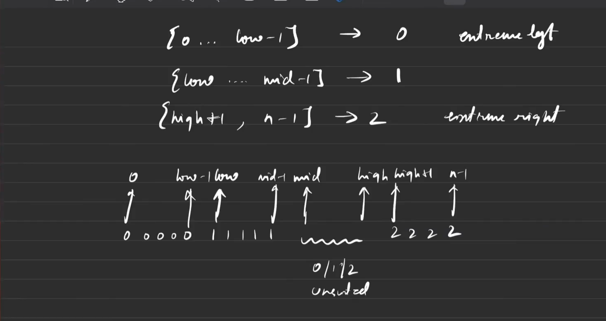
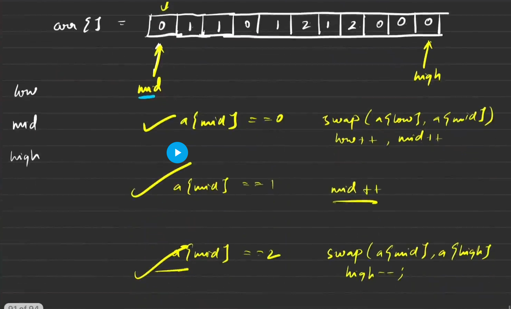

## Sort an array of 0's 1's and 2's
Given an array nums consisting of only 0, 1, or 2. Sort the array in non-decreasing order. The sorting must be done in-place, without making a copy of the original array.

## Must Watch video of Striver


- we are focusing on mid to high because question has alwys unsorted array and accroding to range unsorted lies bw there only.




```java
import java.util.*;

class Solution {
    // Function to sort the array containing only 0s, 1s, and 2s
    public void sortZeroOneTwo(int[] nums) {
        // 3 pointers: low, mid, high
        int low = 0, mid = 0, high = nums.length - 1;

        while (mid <= high) {
            if (nums[mid] == 0) {

                /* Swap nums[low] and nums[mid], then
                move both low and mid pointers forward*/
                int temp = nums[low];
                nums[low] = nums[mid];
                nums[mid] = temp;
                low++;
                mid++;

            } else if (nums[mid] == 1) {
                // Move mid pointer forward
                mid++;
            } else {
                /* Swap nums[mid] and nums[high],
                then move high pointer backward*/
                int temp = nums[mid];
                nums[mid] = nums[high];
                nums[high] = temp;
                high--;
            }
        }
    }

    public static void main(String[] args) {
        int[] nums = {0, 2, 1, 2, 0, 1};

        // Create an instance of Solution class
        Solution sol = new Solution();

        sol.sortZeroOneTwo(nums);

        // Print the array elements after sorting
        System.out.println("After sorting:");
        for (int num : nums) {
            System.out.print(num + " ");
        }
        System.out.println();
    }
}

```

**Complexity Analysis**
**Time Complexity:** O(N), where N is the size of the array, as there is single traversal of the array.
**Space Complexity:** O(1), no extra space is used.
